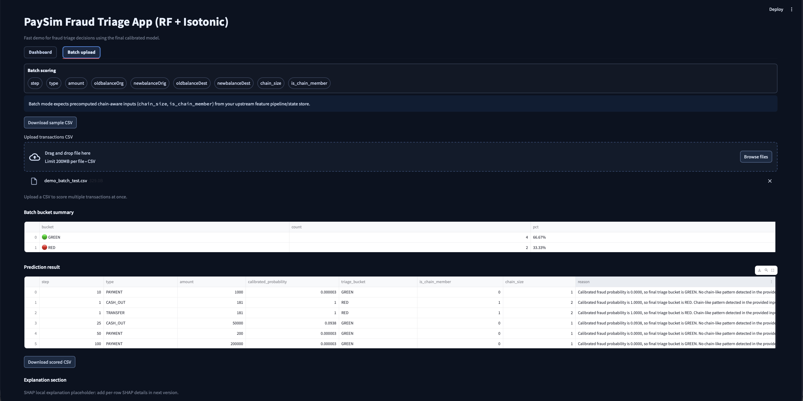

# PaySim Fraud Triage — Chain-Aware Mobile-Money Fraud Detection

**Course / research-style ML project** on the synthetic **PaySim** mobile-money dataset: exploratory analysis, **leakage-aware** feature design, **no-chain vs chain-aware** model comparison, **probability calibration**, **cost-sensitive** triage rules, and a **Streamlit** deployment for interactive and batch scoring.


*Proposed solution overview: PaySim → EDA → stratified split → split-safe chain discovery & features → preprocessing → model comparison → RF (chain-aware) + calibration → triage; plus validation (SHAP/LIME, bootstrap CI, error analysis, drift/PSI) and Streamlit deployment.*

---

## Abstract (problem & goal)

PaySim simulates digital payment flows with extreme **class imbalance** (fraud is rare). The goal is not only high discrimination (e.g. PR-AUC) but **decision-ready** outputs: calibrated fraud probabilities and a **three-way triage** (approve / review / block) aligned with asymmetric **false-positive vs false-negative** costs. This repository implements that pipeline end-to-end and documents **why** each modeling choice was made.

---

## Contributions & novelty

1. **Chain-aware behavioral features (domain-motivated)**  
   Fraud in mobile money often involves **multi-hop** patterns (e.g. **TRANSFER** followed by **CASH_OUT**). We encode this without using the label by grouping rows on **`(step, amount)`**, counting co-occurring types, and defining:
   - **`chain_size`**: number of rows in the `(step, amount)` group.
   - **`is_chain_member`**: group contains both **TRANSFER** and **CASH_OUT**, with **`chain_size` ≤ 12** (`CHAIN_SIZE_CAP`) to avoid treating huge accidental collisions as “chains.”  

   These features are **not** derived from `isFraud`; they are structural signals aligned with known PaySim fraud narratives.

2. **Controlled A/B: no-chain vs chain-aware**  
   In `01_eda_paysim.ipynb` (**§12**), we train and evaluate the same model families **with** and **without** chain columns, producing an explicit **`*_no_chain` vs `*_chain`** comparison table (e.g. PR-AUC, recall). That supports the claim that chain features **help** under the same split and preprocessing, rather than ad-hoc tuning.

3. **Calibration + triage, not raw scores**  
   Tree ensembles can be **poorly calibrated**. In the notebook, we compare RF calibration variants (`rf_plain_uncalibrated`, `rf_plain_sigmoid`, `rf_plain_isotonic`) and select the final deployed calibration path **dynamically within the RF family** using Brier-first ranking with PR-AUC/ROC-AUC tie-breaks. The Streamlit app uses calibrated probabilities for **GREEN / YELLOW / RED** buckets with thresholds from artifact metadata.

4. **Cost-aware policy transparency**  
   The UI surfaces a simple cost model (**false-positive cost = 5**, **false-negative cost = 500**) so reviewers see that thresholds reflect **business asymmetry**, not arbitrary cutoffs.

5. **Leakage-aware baseline design**  
   We **drop** `isFlaggedFraud` from features (rule-like flag aligned with fraud), **drop** high-cardinality IDs (`nameOrig`, `nameDest`) for the tabular baseline, and use **`log_amount`** instead of raw **`amount`** in the feature matrix to avoid redundant scaling signals. Post-transaction balances are kept for this academic setting but **flagged** in the notebook as an **operational caveat** for real-time deployment.

---

## Methodology (how we decided)

| Stage | Decision | Rationale |
|--------|-----------|-----------|
| **Split** | Stratified train/test (`test_size=0.2`, fixed `RANDOM_STATE`) | Preserve rare fraud rate in both sets; reproducibility. |
| **Preprocessing** | `ColumnTransformer`: `StandardScaler` on numeric, `OneHotEncoder(handle_unknown="ignore")` on `type` | Linearly sensitive models need scaling; trees still receive consistent numeric inputs; unknown categories at inference. |
| **Engineered numeric features** | `orig_delta`, `dest_delta`, `orig_residual`, zero-balance flags, `log_amount` | Captures balance consistency and scale skew; documented in EDA. |
| **Chain features** | Groupby `(step, amount)` + TRANSFER ∧ CASH_OUT + cap | Domain pattern; cap limits noise from massive groups. |
| **Models compared** | Logistic Regression, Random Forest, XGBoost, LightGBM (notebook) | Baseline linear, strong non-linear ensemble, and two gradient boosting benchmarks. |
| **Final scorer (app + `build_artifacts.py`)** | Random Forest + **dynamic RF-family calibration** (`FINAL_MODEL_KEY` in notebook) | Keeps base family fixed to RF while allowing run-specific calibrated-path selection for operations. |
| **Triage** | Operating 0.50; review ≥ 0.40; block ≥ 0.60; chain escalation for moderate scores | Three-way policy; chain members near **moderate** risk can be escalated (see `app.py` / notebook). |

### Additional methods added for robustness / clarity

- **SMOTE (optional)** in the notebook experiments to mitigate extreme class imbalance during training.
- **Class-weight (optional)** in the notebook experiments to compare cost-sensitive learning behavior vs SMOTE.
- **LIME vs SHAP (notebook-only)** local explanation cross-check for one blocked transaction:
  - SHAP is model-faithful local attribution (primary explanation).
  - LIME is a perturbation-based surrogate (used only as an academic robustness comparison).
- **Bootstrap PR-AUC CI (notebook-only)** after final calibration to quantify uncertainty of PR-AUC on the untouched test split.
- **Error Analysis (notebook-only)** section on false negatives and false positives for the final deployed/demo policy, including compact tables and grouped summaries.

**Important methodology note (academic honesty):** in `01_eda_paysim.ipynb` and `build_artifacts.py`, `chain_size` and `is_chain_member` are computed **after** the stratified train/test split, **separately on training vs test rows** (so the test set does not inform training-side group statistics). A **production** system would still materialize chain state from **transaction history up to decision time** in a streaming-safe way; the Streamlit **manual** path can use fallback chain fields as documented in the UI.

---

## Results & evidence

Quantitative metrics (**PR-AUC**, confusion matrices, ROC, calibration curves, **SHAP** where run) live in **`01_eda_paysim.ipynb`** after the training cells. **Figures below** illustrate the Streamlit prototype and triage story; cite the notebook for tables and plots used in your report.

The Streamlit app has 5 tabs:
- **Command Center:** deployment snapshot, policy-at-a-glance logic, and quick navigation overview for the demo.
- **Dashboard:** single-transaction scoring + triage decision panel with SHAP-driven local risk drivers (optional SHAP visual).
- **Batch upload:** upload a CSV to score many transactions + bucket summary (SHAP disabled for speed).
- **Drift Monitor (monitoring-only):** early vs late windows (`step <= 400` vs `step > 400`) with feature drift (PSI table + summary chart) and PR-AUC early/late comparison; **no retraining**.
- **Model Card:** shows `MODEL_CARD.md` (deployed system documentation: model, calibration, triage policy, drift monitoring, and limitations).

### Optional local LLM explanation layer (Ollama)

If enabled in Streamlit, the LLM is used only as an **analyst-style explanation assistant** after prediction is complete.

**Academic honesty note:**  
**Analyst summary is generated by a local LLM for explanation only. Fraud score and final action come from the calibrated ML pipeline.**

Pipeline placement:

`transaction input -> preprocessing -> RF + selected calibration -> fraud probability -> triage bucket -> SHAP / reasons -> LLM analyst summary`

This keeps the LLM strictly in the explanation layer; it does not change model training, calibration, thresholds, or triage decisions.

---

## Figure gallery

### A) Streamlit app screens

The prototype has **five tabs**: Command Center, Dashboard, Batch upload, Drift Monitor, and Model Card. Key screens are shown below (batch scoring still uses CSV upload + bucket summary as in deployment).

**Command Center** — deployment snapshot, hero banner with decision pipeline, policy at a glance, and quick orientation:


**Dashboard** — manual transaction scoring, triage panel, SHAP explanations, and optional analyst summary:


**Batch upload** — CSV upload + bucket summary (fast scoring without SHAP):


**Drift Monitor** — PSI feature drift table, summary chart, optional PR-AUC early vs late comparison (monitoring-only):


**Model Card** — renders `MODEL_CARD.md` with intended use, data, thresholds, and limitations:


### B) Notebook outputs (modeling evidence)

**Reliability / calibration comparison (RF vs XGB; uncalibrated/sigmoid/isotonic):**


**Threshold sweep and selected operating threshold:**


**Triage buckets after chain-escalation policy:**


**SHAP global summary (feature impact):**


---

## Tech stack

| Area | Tools |
|------|--------|
| Language | Python 3 |
| Analysis | Jupyter, pandas, numpy |
| ML | scikit-learn, joblib; notebook also uses **imbalanced-learn (SMOTE)** where configured, **XGBoost**, **LightGBM**, **SHAP**, plotting libraries |
| App | Streamlit |
| Data | PaySim CSV (`PS_20174392719_1491204439457_log.csv`) — **gitignored by default** (large) |

**Install (app only):**

```bash
pip install -r requirements.txt
```

`requirements.txt` already includes **SHAP** (used in both Streamlit and the notebook).

**Notebook extras (install as needed — LIME is notebook-only):**

```bash
pip install jupyter matplotlib seaborn imbalanced-learn xgboost lightgbm lime
```

---

## Repository layout

```
Group_Project/
├── README.md
├── requirements.txt
├── .gitignore
├── app.py
├── build_artifacts.py
├── artifacts/                 # after build: preprocessor, RF, calibrator, metadata
├── assets/                    # banner SVG + README screenshots
├── 01_eda_paysim.ipynb
├── MODEL_CARD.md
└── PS_20174392719_1491204439457_log.csv   # local only unless you use LFS / remove gitignore
```

---

## Quick start

```bash
cd Group_Project
python -m venv .venv
source .venv/bin/activate   # Windows: .venv\Scripts\activate
pip install -r requirements.txt
```

Place **`PS_20174392719_1491204439457_log.csv`** in the project root (see [PaySim on Kaggle](https://www.kaggle.com/datasets/ealaxi/paysim1) or your course mirror), then:

```bash
python build_artifacts.py
streamlit run app.py
```

---

## Batch CSV (production-style inputs)

Required columns:

`step`, `type`, `amount`, `oldbalanceOrg`, `newbalanceOrig`, `oldbalanceDest`, `newbalanceDest`, **`chain_size`**, **`is_chain_member`**

Batch scoring assumes chain fields are **precomputed** (mirroring offline EDA). Manual demo mode can use **fallback** chain values; the UI states this limitation.

---

## Limitations (for reports & defense)

- **Synthetic data:** PaySim is not live production traffic; generalization claims must be qualified.  
- **Chain timing:** offline evaluation uses **split-safe** chain features (per split after `train_test_split`); a live system still needs **streaming-safe** chain state from history at decision time.  
- **Post-transaction balances:** available in the dataset; real-time systems may not have the same fields at decision time.  
- **YELLOW bucket:** with current calibration and scores, moderate-risk rows can be sparse; triage logic is still correct and documented.

---

## Data note

`PS_20174392719_1491204439457_log.csv` is large and gitignored by default. Use Git LFS only if you want to version the raw file.
