# PaySim Fraud Triage — Chain-Aware Mobile-Money Fraud Detection

> **Status:** completed end-to-end research / coursework project.
> **Repo:** [github.com/Snehasingh-21/PaySim-Fraud-Triage](https://github.com/Snehasingh-21/PaySim-Fraud-Triage)
> **Deployed scorer (reference export):** `catboost_plain_sigmoid` (calibrated CatBoost) — see [post-calibration leaderboard](#post-calibration-leaderboard-chain-aware-finalists-128).

### Course submission (notebook + Streamlit + visible results)

Submit this **GitHub repo URL**: [https://github.com/Snehasingh-21/PaySim-Fraud-Triage](https://github.com/Snehasingh-21/PaySim-Fraud-Triage).

**One-click links (for professor review):**
- **Notebook (`.ipynb`)**: [Open notebook](https://github.com/Snehasingh-21/PaySim-Fraud-Triage/blob/main/01_eda_paysim.ipynb)
- **Live report (GitHub Pages)**: [Open rendered report](https://snehasingh-21.github.io/PaySim-Fraud-Triage/report_latest.html)
- **Streamlit screenshots gallery**: [Jump to Streamlit screenshots](#a-streamlit-app-screens)

| Deliverable | Location |
|-------------|----------|
| **Notebook** (code + saved plots/tables/metrics) | [`01_eda_paysim.ipynb`](01_eda_paysim.ipynb) |
| **Rendered report (recommended)** | [GitHub Pages report](https://snehasingh-21.github.io/PaySim-Fraud-Triage/report_latest.html) |
| **Streamlit app** | [`app.py`](app.py) — run from repo root: `streamlit run app.py` (loads calibrated model + thresholds from [`artifacts/feature_metadata.json`](artifacts/feature_metadata.json), produced by the notebook export section). |

The notebook and the app share one consistent scoring contract: **`artifacts/`** matches the notebook’s **`final_model_key`** / calibration export.

**Course / research-style ML project** on the synthetic **PaySim** mobile-money dataset: exploratory analysis, **leakage-aware** feature design, **no-chain vs chain-aware** model comparison, **probability calibration**, **cost-sensitive** triage rules, **drift monitoring (PSI)**, and a **Streamlit** deployment for interactive single-transaction scoring + CSV batch scoring (with an optional local-LLM analyst summary via **Ollama**).

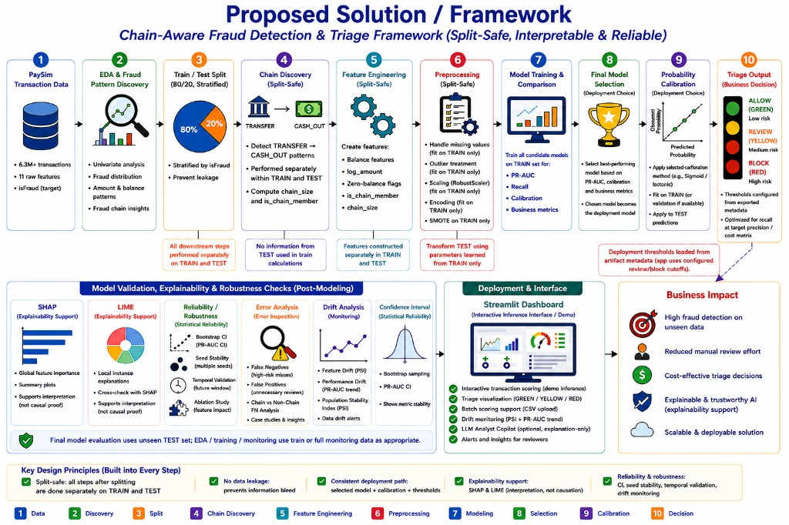

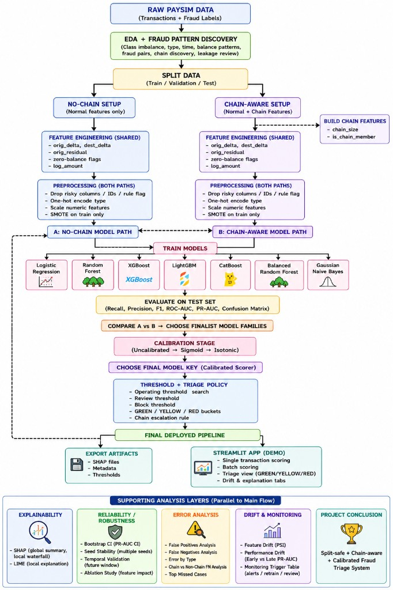

*Above: proposed solution infographic, then detailed flowchart — PaySim → EDA → stratified split → split-safe chain discovery & features → preprocessing → model comparison → **calibration** (reference export: **`catboost_plain_sigmoid`**) → triage; plus validation (SHAP/LIME, bootstrap CI, error analysis, drift/PSI) and Streamlit deployment.*

---

## Abstract (problem & goal)

PaySim simulates digital payment flows with extreme **class imbalance** (fraud is rare). The goal is not only high discrimination (e.g. PR-AUC) but **decision-ready** outputs: calibrated fraud probabilities and a **three-way triage** (approve / review / block) aligned with asymmetric **false-positive vs false-negative** costs. This repository implements that pipeline end-to-end and documents **why** each modeling choice was made.

---

## Contributions & novelty

1. **Chain-aware behavioral features (domain-motivated)**  
   Fraud in mobile money often involves **multi-hop** patterns (e.g. **TRANSFER** followed by **CASH_OUT**). We encode this without using the label by grouping rows on **`(step, amount)`**, counting co-occurring types, and defining:
   - **`chain_size`**: number of rows in the `(step, amount)` group.
   - **`is_chain_member`**: group contains both **TRANSFER** and **CASH_OUT**, with **`chain_size` ≤ 12** (`CHAIN_SIZE_CAP`) to avoid treating huge accidental collisions as “chains.”  

   These features are **not** derived from `isFraud`; they are structural signals aligned with known PaySim fraud narratives.

2. **Controlled A/B: no-chain vs chain-aware**  
   In `01_eda_paysim.ipynb` (**§12**), we train and evaluate the same model families **with** and **without** chain columns, producing an explicit **`*_no_chain` vs `*_chain`** comparison table (e.g. PR-AUC, recall). That supports the claim that chain features **help** under the same split and preprocessing, rather than ad-hoc tuning.

3. **Calibration + triage, not raw scores**  
   Boosted/tree models can be **poorly calibrated**. The notebook calibrates **finalists** (RF, CatBoost, XGBoost, …). In the **documented full run**, **`catboost_plain_sigmoid`** (calibrated CatBoost) wins; **`FINAL_MODEL_KEY`** always records whichever finalist actually wins your run. The notebook exports **`artifacts/feature_metadata.json`**, and the app scores with that **calibrated** pipeline. **`build_artifacts.py`** alone stays within **RF** calibration variants for a lightweight fallback. Thresholds for **GREEN / YELLOW / RED** come from exported metadata.

4. **Cost-aware policy transparency**  
   The UI surfaces a simple cost model (**false-positive cost = 5**, **false-negative cost = 500**) so reviewers see that thresholds reflect **business asymmetry**, not arbitrary cutoffs.

5. **Leakage-aware baseline design**  
   We **drop** `isFlaggedFraud` from features (rule-like flag aligned with fraud), **drop** high-cardinality IDs (`nameOrig`, `nameDest`) for the tabular baseline, and use **`log_amount`** instead of raw **`amount`** in the feature matrix to avoid redundant scaling signals. Post-transaction balances are kept for this academic setting but **flagged** in the notebook as an **operational caveat** for real-time deployment.

---

## Methodology (how we decided)

| Stage | Decision | Rationale |
|--------|-----------|-----------|
| **Split** | Stratified train/test (`test_size=0.2`, fixed `RANDOM_STATE`) | Preserve rare fraud rate in both sets; reproducibility. |
| **Preprocessing** | `ColumnTransformer`: `StandardScaler` on numeric, `OneHotEncoder(handle_unknown="ignore")` on `type` | Linearly sensitive models need scaling; trees still receive consistent numeric inputs; unknown categories at inference. |
| **Engineered numeric features** | `orig_delta`, `dest_delta`, `orig_residual`, zero-balance flags, `log_amount` | Captures balance consistency and scale skew; documented in EDA. |
| **Chain features** | Groupby `(step, amount)` + TRANSFER ∧ CASH_OUT + cap | Domain pattern; cap limits noise from massive groups. |
| **Models compared** | **Supervised (§12.4):** `logreg_plain`, `logreg_class_weight`, `logreg_smote`, `rf_plain`, `rf_class_weight`, `rf_smote`, `xgb_plain`, `lgbm_plain`, `lgbm_weighted`, `brf_plain`, `gnb_plain`, `catboost_plain` (when available). **Anomaly baseline (§12.7b):** `Isolation Forest`. | Same chain-aware preprocessing for every supervised model; finalists for calibration (§12.7a → §12.8) are chosen dynamically from the shortlist. |
| **Final scorer** | **Reference export:** **`catboost_plain_sigmoid`** (calibrated CatBoost) via **`final_model_key`** + **`calibration_model_file_map`**. Optional **`build_artifacts.py`**: RF-family calibration only. | App loads metadata-driven scorer; **Tree SHAP** targets the **deploy model’s inner tree** when supported (**CatBoost**/XGB/RF unwrap). **`rf_plain_base.joblib`** remains a packaged **fallback** only. |
| **Triage** | Three-way **GREEN / YELLOW / RED** from exported thresholds (`review_threshold`, `block_threshold`, `moderate_cutoff` in `feature_metadata.json`) | Values depend on your notebook §12.9b run; chain escalation rule matches that export. |

### Additional methods added for robustness / clarity

- **SMOTE (optional)** in the notebook experiments to mitigate extreme class imbalance during training.
- **Class-weight (optional)** in the notebook experiments to compare cost-sensitive learning behavior vs SMOTE.
- **LIME vs SHAP (notebook-only)** local explanation cross-check for one blocked transaction:
  - SHAP is model-faithful local attribution (primary explanation).
  - LIME is a perturbation-based surrogate (used only as an academic robustness comparison).
- **Bootstrap PR-AUC CI (notebook-only)** after final calibration to quantify uncertainty of PR-AUC on the untouched test split.
- **Error Analysis (notebook-only)** section on false negatives and false positives for the final deployed/demo policy, including compact tables and grouped summaries.
- **Isolation Forest (§12.7b, notebook-only):** unsupervised anomaly baseline on chain-aware features (`IsolationForest`), train-only fit with **no labels**, threshold from **training** anomaly scores (contamination anchored to train fraud rate) so evaluation stays split-safe; PR-AUC / precision / recall vs test labels for comparison only. **Not** in calibration, **`FINAL_MODEL_KEY`**, artifact export, SHAP, triage rules, or Streamlit — supervised calibrated path is unchanged.

**Important methodology note (academic honesty):** in `01_eda_paysim.ipynb` and `build_artifacts.py`, `chain_size` and `is_chain_member` are computed **after** the stratified train/test split, **separately on training vs test rows** (so the test set does not inform training-side group statistics). A **production** system would still materialize chain state from **transaction history up to decision time** in a streaming-safe way; the Streamlit **manual** path can use fallback chain fields as documented in the UI.

---

## Why the chain-aware setup is the deployed path (A/B evidence, §12.4 → §12.5)

Every experiment in §12.4 is trained **twice** under the same split, same labels, same preprocessing — once **without** `chain_size` / `is_chain_member` (setup A), once **with** them (setup B). The only deliberate difference is which columns enter the `ColumnTransformer`. The full A/B numbers are in the notebook's `chain_vs_no_chain_table`; the per-model summary below uses the PR-AUC column from that table.

| Experiment | PR-AUC (no-chain, A) | PR-AUC (chain-aware, B) | Δ PR-AUC (B − A) | Interpretation |
|---|---:|---:|---:|---|
| `gnb_plain` | 0.2822 | **0.4125** | **+0.1303** | Naive Bayes goes from unusable to mediocre — chain is a strong signal it can't fake |
| `logreg_class_weight` | 0.6931 | **0.7759** | **+0.0828** | Linear model gains a real chunk of PR-AUC |
| `lgbm_weighted` | 0.0142 | **0.0378** | **+0.0236** | Still poor in absolute terms, but ~2.7× better with chain |
| `logreg_smote` | 0.8273 | **0.8395** | **+0.0122** | Small but consistent gain on the linear baseline |
| `logreg_plain` | 0.8217 | **0.8321** | **+0.0104** | Same pattern as above |
| `rf_plain` | 0.9981 | **0.9985** | **+0.0004** | Already near ceiling — chain is neutral / mildly helpful |
| `catboost_plain` | 0.9986 | 0.9986 | −0.0001 | Indistinguishable at the test-set ceiling |
| `rf_class_weight` | 0.9984 | 0.9983 | −0.0001 | Same — at the ceiling |
| `rf_smote` | 0.9981 | 0.9979 | −0.0002 | Same — at the ceiling |
| `xgb_plain` | 0.9981 | 0.9937 | −0.0044 | Tiny regression — within noise at this scale |
| `brf_plain` | 0.9971 | 0.9631 | −0.0340 | Sub-bagged tree drops some precision when extra features are added |
| `lgbm_plain` | 0.8352 | 0.5185 | −0.3168 | LightGBM-plain destabilizes with the chain columns (hyperparameter sensitivity) |

> Direction matters here, not the magnitude at the top of the table — `catboost_plain` / `rf_plain` already sit at the PR-AUC ceiling on this synthetic dataset, so neither direction of Δ is statistically meaningful for them. The chain signal is doing its real work on the **weaker / linear / NB** models, where it lifts PR-AUC by hundreds of basis points.

### Why we keep the chain-aware setup as the deployed path

Even though the top tree models look unchanged on PR-AUC, the chain-aware pipeline is the one we ship for **five concrete reasons**:

1. **Domain alignment.** The canonical PaySim fraud narrative is *TRANSFER → CASH_OUT* on the same `(step, amount)`. Encoding that as `is_chain_member` makes the feature space match the documented attack pattern instead of forcing the model to rediscover it from raw rows.
2. **Robust gains for non-tree models.** `gnb_plain` (+0.1303), `logreg_class_weight` (+0.0828), `logreg_smote` (+0.0122), `logreg_plain` (+0.0104) all improve. Even if we deploy CatBoost, the same preprocessing has to work for the entire model zoo we benchmark against.
3. **No measurable downside for the deployed model.** `catboost_plain` chain vs no-chain is Δ −0.0001 (indistinguishable). We get domain interpretability for free.
4. **Triage policy depends on it.** The §12.9b cost-aware thresholds export a **chain-escalation rule** (`is_chain_member == 1 AND prob ≥ moderate_cutoff` → escalate YELLOW to RED). That rule is meaningless without `is_chain_member` at scoring time, so the **deployed scorer must be trained with the chain columns** to keep the input contract consistent.
5. **Explainability surfaces it.** Tree SHAP on the deployed model lists `num__is_chain_member` and `num__chain_size` among the top local drivers for chain-pattern transactions; this is what makes the Dashboard's "why this decision" panel intelligible for non-technical reviewers.

**Decision:** keep chain-aware (setup B) as the **single** deployed pipeline — `app.py`, `build_artifacts.py`, `feature_metadata.json`, and the triage rules are all wired to expect `chain_size` + `is_chain_member` at inference time. Setup A (no-chain) remains in the notebook only, as the A/B control that this section evidences.

---

## All models trained & post-calibration leaderboard

**Total supervised models trained (chain-aware, §12.4):** **12**

| # | Model key | Family | Imbalance handling |
|---|-----------|--------|-------------------|
| 1 | `logreg_plain` | Logistic Regression | plain |
| 2 | `logreg_class_weight` | Logistic Regression | class-weight |
| 3 | `logreg_smote` | Logistic Regression | SMOTE |
| 4 | `rf_plain` | Random Forest | plain |
| 5 | `rf_class_weight` | Random Forest | class-weight |
| 6 | `rf_smote` | Random Forest | SMOTE |
| 7 | `xgb_plain` | XGBoost | plain (scale_pos_weight) |
| 8 | `lgbm_plain` | LightGBM | plain |
| 9 | `lgbm_weighted` | LightGBM | class-weight |
| 10 | `brf_plain` | Balanced Random Forest | inherent |
| 11 | `gnb_plain` | Gaussian Naive Bayes | plain |
| 12 | `catboost_plain` | CatBoost (when installed) | plain |

**Anomaly baseline (notebook §12.7b, not deployed):** `Isolation Forest` — see [Anomaly Baseline — Isolation Forest](#anomaly-baseline--isolation-forest) below.

### Pre-calibration leaderboard (chain-aware, §12.4 → §12.7a)

This is the table that **drives the finalist selection** for §12.8 calibration. Same stratified split, same chain-aware preprocessing for every row. Values are taken from the notebook's `metrics_with_chain` after §12.4 (chain-aware setup B), `REPORT_EXPERIMENTS` view.

Sorted by **PR-AUC ↓, Recall ↓, Precision ↓** — the exact lexicographic rule §12.7a uses to pick the calibration shortlist.

| Rank | Model | Precision | Recall | F1 | ROC-AUC | PR-AUC | Notes |
|---|-------|-----------|--------|----|---------|--------|-------|
| 1 | **`catboost_plain`** ⭐ | **1.0000** | **0.9976** | **0.9988** | **0.9999** | **0.9986** | Leader → calibration finalist |
| 2 | **`rf_plain`** ⭐ | 1.0000 | 0.9976 | 0.9988 | 0.9996 | 0.9985 | Top-2 → mandatory finalist |
| 3 | **`xgb_plain`** ⭐ | 0.9994 | 0.9890 | 0.9942 | 0.9988 | 0.9937 | Close to leader → extra finalist |
| 4 | `brf_plain` | 0.6015 | 0.9452 | 0.7351 | 0.9993 | 0.9631 | Recall OK but precision too low — fails the floor |
| 5 | `logreg_plain` | 0.9853 | 0.6117 | 0.7548 | 0.9947 | 0.8321 | Recall too low |
| 6 | `lgbm_plain` | 0.5730 | 0.8929 | 0.6981 | 0.9017 | 0.5185 | Far from leader on PR-AUC |
| 7 | `gnb_plain` | 0.0069 | 0.9963 | 0.0138 | 0.9875 | 0.4125 | Recall-only; precision ≈ 0 |
| 8 | `lgbm_weighted` | 0.0397 | 0.9501 | 0.0762 | 0.9602 | 0.0378 | Far from leader on PR-AUC |

> Same eight rows are shown in the notebook output of §12.5 ("B. Chain-aware metrics (selected models)"). The four remaining experiments — `logreg_class_weight`, `logreg_smote`, `rf_class_weight`, `rf_smote` — are trained and evaluated but kept off this comparison view since they sit either inside (`rf_class_weight`, `rf_smote` ≈ `rf_plain`) or below (`logreg_class_weight`, `logreg_smote` ≈ `logreg_plain`) the corresponding plain row.

**How the top 3 were chosen for calibration (§12.7a policy):**

- **Step 1 — mandatory top 2** (always promoted): the **two leaders** under `PR-AUC ↓, Recall ↓, Precision ↓` → `catboost_plain`, `rf_plain`.
- **Step 2 — extras only if close to the leader**: include any model whose gap to the leader satisfies **PR-AUC gap ≤ 0.01**, **Recall gap ≤ 0.01**, **Precision ≥ 0.02 (floor)**, capped by `MAX_FINALISTS` — only `xgb_plain` qualifies (Δ PR-AUC = 0.0049, Δ Recall = 0.0086, Precision = 0.9994).
- **Step 3 — everyone else dropped**: `brf_plain` is filtered out by the precision floor (0.6015 vs ≈ 1.0000 leader); `lgbm_plain` / `lgbm_weighted` / `gnb_plain` / `logreg_plain` fall outside both PR-AUC and Recall gaps.

**Result:** three chain-aware finalists go into §12.8 — `catboost_plain`, `rf_plain`, `xgb_plain` — each calibrated with **sigmoid** and **isotonic**, producing the **9-row post-calibration table** below.

### Post-calibration leaderboard (chain-aware finalists, §12.8)

Finalists shortlisted by §12.7a are calibrated with **sigmoid** and **isotonic** (`CalibratedClassifierCV`, `cv=CALIBRATION_CV` fit on train, evaluated on held-out test). Values below are copied from **`artifacts/feature_metadata.json`** (`calibration_comparison_table`) for the checked-in export.

| Model | Brier ↓ | ROC-AUC ↑ | PR-AUC ↑ |
|-------|---------|-----------|----------|
| `catboost_plain_uncalibrated` | 3.261e-06 | 0.999905 | 0.998554 |
| **`catboost_plain_sigmoid`** ⭐ **winner** | **3.144e-06** | **0.999905** | **0.998554** |
| `catboost_plain_isotonic` | 3.187e-06 | 0.999851 | 0.998447 |
| `rf_plain_uncalibrated` | 7.460e-06 | 0.999645 | 0.998508 |
| `rf_plain_sigmoid` | 3.276e-06 | 0.999645 | 0.998508 |
| `rf_plain_isotonic` | 3.337e-06 | 0.999646 | 0.998239 |
| `xgb_plain_uncalibrated` | 1.428e-05 | 0.998754 | 0.993653 |
| `xgb_plain_sigmoid` | 1.486e-05 | 0.998754 | 0.993653 |
| `xgb_plain_isotonic` | 1.440e-05 | 0.998300 | 0.993112 |

**Selection rule (from metadata):** `lowest_brier_then_higher_pr_auc_then_higher_roc_auc` (RF preferred only when explicitly enabled).
**`final_model_key` = `catboost_plain_sigmoid`** — wins on Brier (best probability calibration) while tying CatBoost-uncalibrated on PR-AUC and ROC-AUC, so the sigmoid wrapper is preferred for triage-style probability outputs.

> Numbers reflect the reference notebook export. Rerunning §12.7a → §12.8 with different finalist policy or CV can change which row wins; the app always reads `final_model_key` from `feature_metadata.json`, never a hard-coded name.

---

## Anomaly Baseline — Isolation Forest

**Where:** notebook **§12.7b** (between §12.7a model comparison and §12.8 calibration).
**Role:** **benchmark only.** Not in calibration, `final_model_key`, artifact export, SHAP, triage rules, or Streamlit. Supervised path is unchanged.

**Setup (split-safe):**
- Inputs: chain-aware processed matrices `Xtr_ch` / `Xte_ch` (same preprocessing as the supervised models).
- `IsolationForest(n_estimators=100, contamination=train fraud rate, random_state=42)` — fit on **train only**, **no labels used**.
- Anomaly threshold: percentile of **train** anomaly scores (`100 * (1 - contamination)`). Scoring runs on the **held-out test** set only — threshold does not see test scores.

**Results vs supervised finalist (pre-calibration, same test split):**

| Model | Type | Label used? | PR-AUC | Recall | Precision | F1 | Role |
|-------|------|-------------|--------|--------|-----------|----|------|
| Best supervised finalist (`catboost_plain` / `rf_plain`) | Supervised | Yes | ≈ 0.998 | ≈ 0.998 | ≈ 1.000 | ≈ 0.999 | Main path → calibration → deployment |
| `Isolation Forest` | Anomaly | **No** | 0.0218 | 0.0134 | 0.0143 | 0.0138 | Benchmark only |

**Interpretation:**
- As a **standalone fraud detector — no.** Unsupervised structure alone does not isolate PaySim fraud anywhere close to the labeled supervised models.
- As a **benchmark — yes.** It confirms (a) fraud signal is **not** trivially structural / leaked, and (b) the supervised gain comes from labels + chain features, not from anything an anomaly detector could trivially exploit.

**Deployment decision:** Isolation Forest stays as a notebook benchmark. `FINAL_MODEL_KEY` = **calibrated CatBoost (`catboost_plain_sigmoid`)** from §12.8 — unchanged. IF output never feeds triage, SHAP, or Streamlit.

---

## Results & evidence

Quantitative metrics (**PR-AUC**, confusion matrices, ROC, calibration curves, **SHAP** where run) live in **`01_eda_paysim.ipynb`** after the training cells. **Figures below** illustrate the Streamlit prototype and triage story; cite the notebook for tables and plots used in your report.

The Streamlit app has 5 tabs:
- **Command Center:** deployment snapshot, policy-at-a-glance logic, and quick navigation overview for the demo.
- **Dashboard:** single-transaction scoring + triage decision panel with SHAP-driven local risk drivers (optional SHAP visual).
- **Batch upload:** upload a CSV to score many transactions + bucket summary (SHAP disabled for speed).
- **Drift Monitor (monitoring-only):** early vs late windows (`step <= 400` vs `step > 400`) with feature drift (PSI table + summary chart) and PR-AUC early/late comparison; **no retraining**.
- **Model Card:** shows `MODEL_CARD.md` (deployed system documentation: model, calibration, triage policy, drift monitoring, and limitations).

### Optional local LLM explanation layer (Ollama)

If enabled in Streamlit, the LLM is used only as an **analyst-style explanation assistant** after prediction is complete.

**Academic honesty note:**  
**Analyst summary is generated by a local LLM for explanation only. Fraud score and final action come from the calibrated ML pipeline.**

Pipeline placement:

`transaction input → preprocessing → calibrated finalist (e.g. `catboost_plain_sigmoid`) → calibrated fraud probability + triage bucket → Tree SHAP on the **same inner booster** when explodable (else `rf_plain_base` fallback) → reasons → optional LLM analyst summary`

This keeps the LLM strictly in the explanation layer; it does not change model training, calibration, thresholds, or triage decisions.

---

## Figure gallery

### A) Streamlit app screens

The prototype has **five tabs**: Command Center, Dashboard, Batch upload, Drift Monitor, and Model Card. Key screens are shown below (batch scoring still uses CSV upload + bucket summary as in deployment).

**Command Center** — deployment snapshot, hero banner with decision pipeline, policy at a glance, and quick orientation:
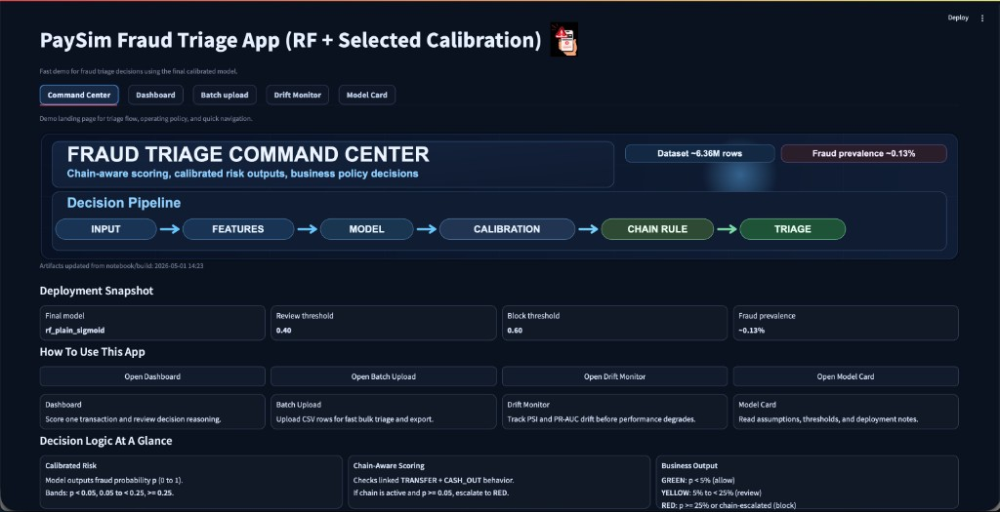

**Dashboard** — manual transaction scoring, triage panel, SHAP explanations, and optional analyst summary:
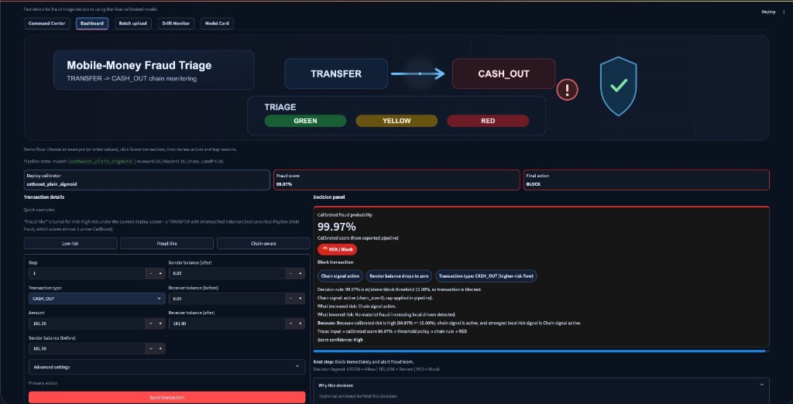
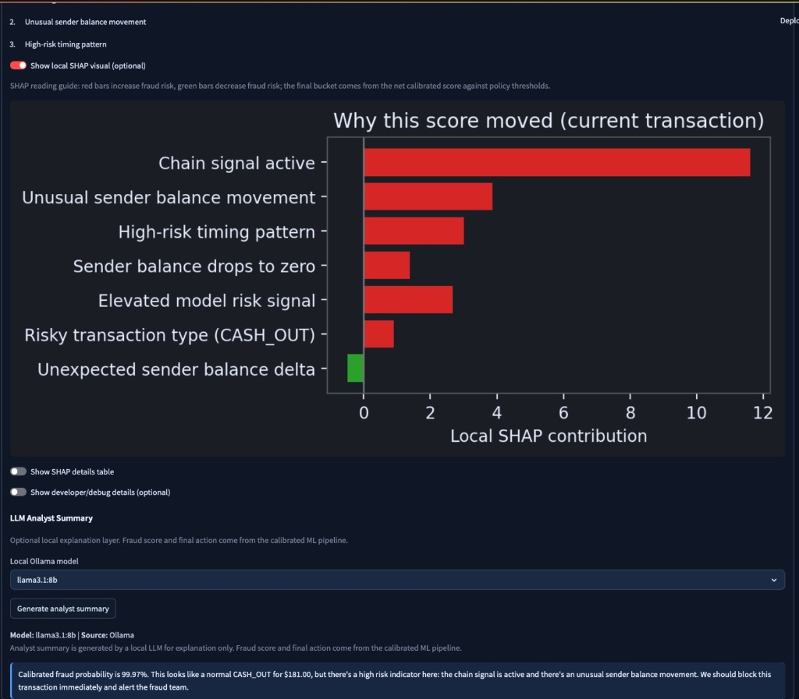

**Batch upload** — CSV upload + bucket summary (fast scoring without SHAP):
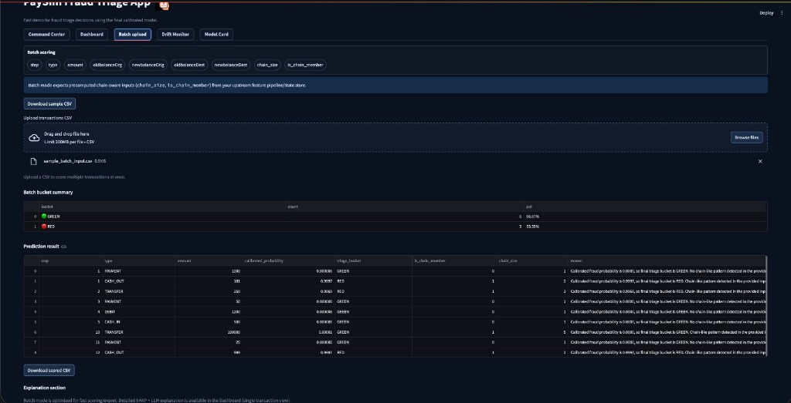

**Drift Monitor** — PSI feature drift table, summary chart, optional PR-AUC early vs late comparison (monitoring-only):
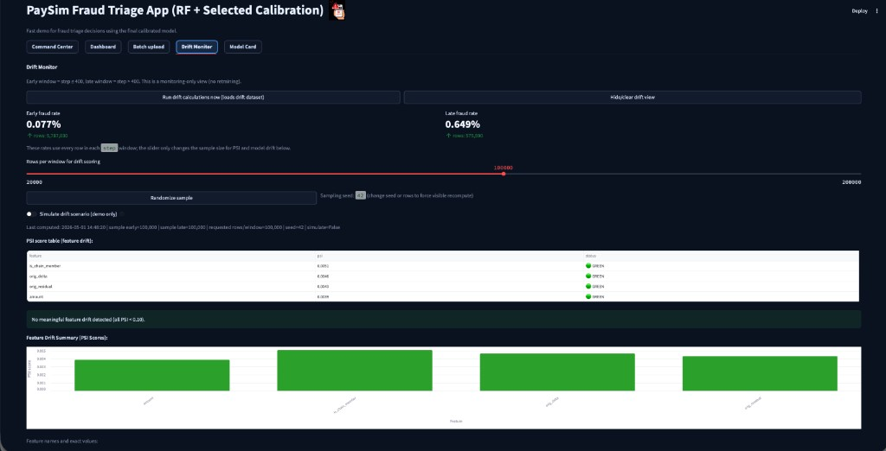

**Model Card** — renders `MODEL_CARD.md` with intended use, data, thresholds, and limitations:
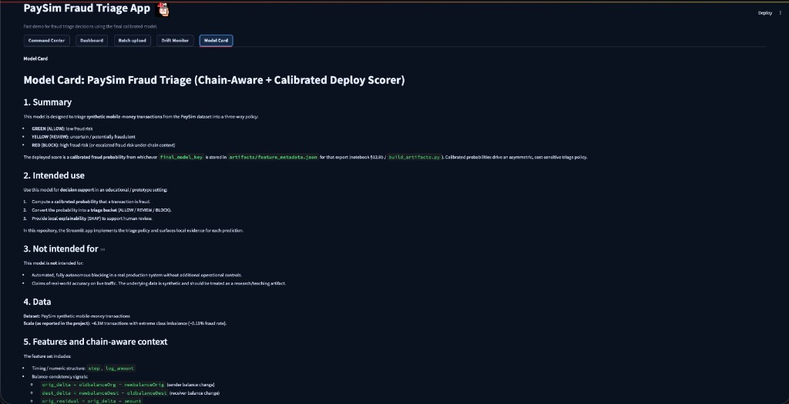

### B) Notebook outputs (modeling evidence)

**Post-calibration leaderboard (notebook §12.8 — finalists × {uncalibrated, sigmoid, isotonic}):**
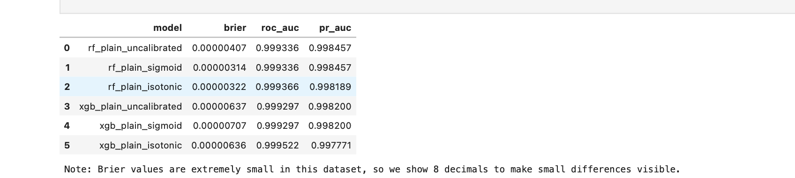

> Reference run shown here covers `rf_plain` + `xgb_plain`; the checked-in `feature_metadata.json` adds `catboost_plain` (full nine-row table is in the [post-calibration leaderboard](#post-calibration-leaderboard-chain-aware-finalists-128) above).

**Reliability / calibration comparison (RF vs XGB; uncalibrated/sigmoid/isotonic):**
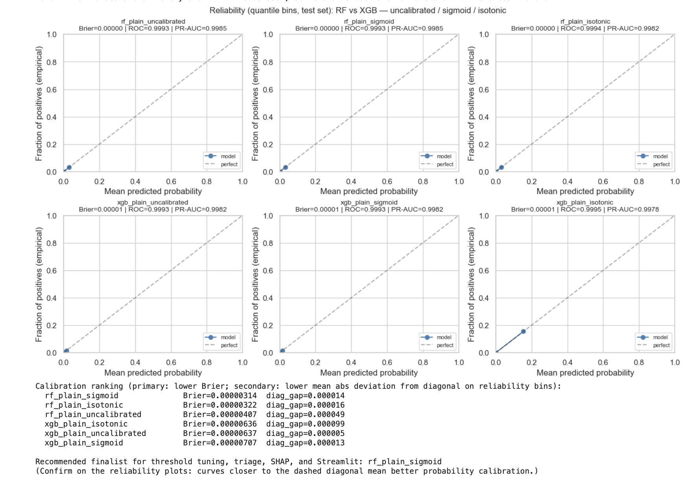

**Threshold sweep and selected operating threshold:**
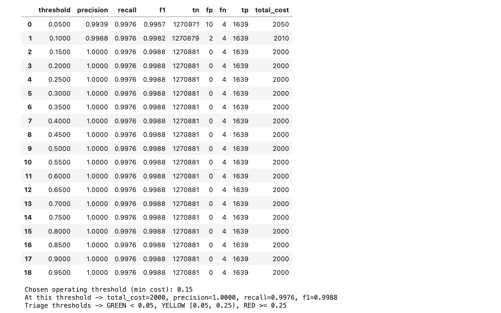

**Triage buckets after chain-escalation policy:**
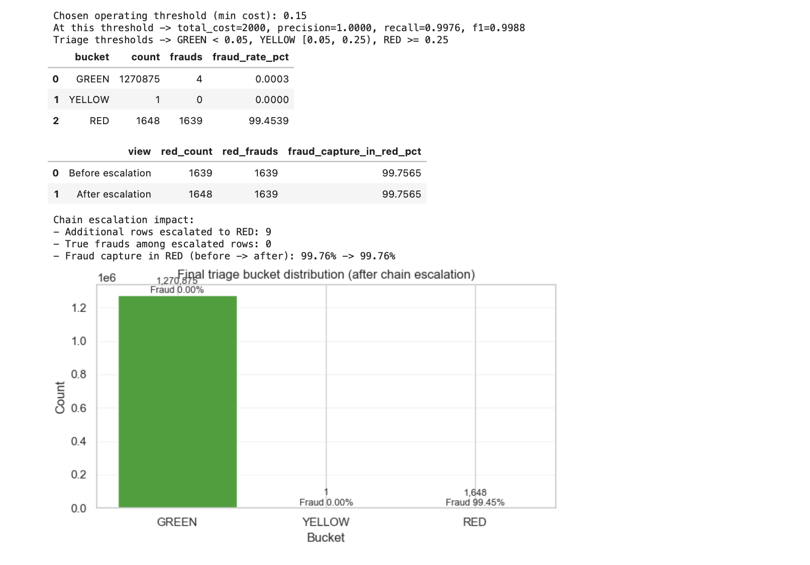

**SHAP global summary (feature impact):**
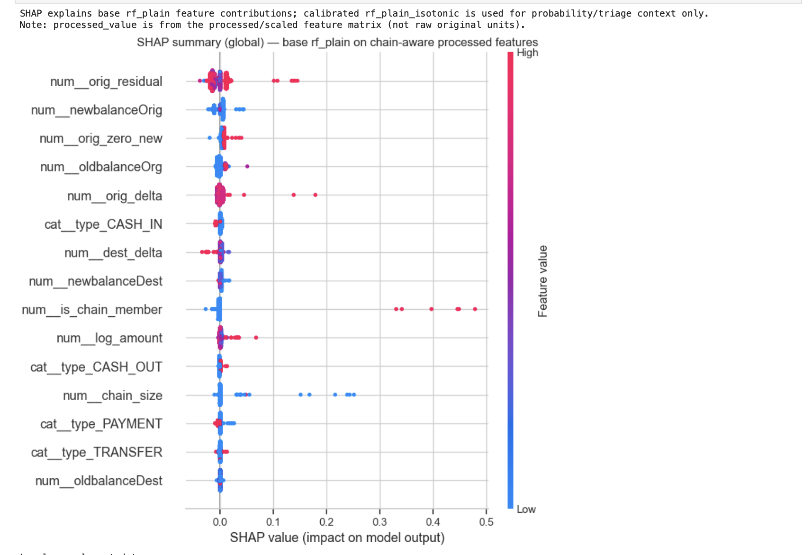

---

## Tech stack

| Area | Tools |
|------|--------|
| Language | Python 3 |
| Analysis | Jupyter, pandas, numpy |
| Supervised ML | scikit-learn (`LogisticRegression`, `RandomForestClassifier`, `GaussianNB`, `CalibratedClassifierCV`), **XGBoost**, **LightGBM**, **CatBoost** (optional), **imbalanced-learn** (SMOTE, `BalancedRandomForestClassifier`) |
| Anomaly baseline | scikit-learn `IsolationForest` (notebook §12.7b, benchmark only) |
| Explainability | **SHAP** (Tree SHAP on deploy booster, deployment) + **LIME** (notebook robustness cross-check) |
| Monitoring | PSI feature drift + early-vs-late PR-AUC (no retraining) |
| App | **Streamlit** (5 tabs: Command Center, Dashboard, Batch upload, Drift Monitor, Model Card) |
| Local LLM (optional) | **Ollama** — analyst-style explanation layer; **never** changes scores or actions |
| Persistence | `joblib` for preprocessor / calibrated model; `feature_metadata.json` for thresholds + model map |
| Data | PaySim CSV (`PS_20174392719_1491204439457_log.csv`) — **gitignored by default** (large) |

**Install everything (app + notebook):**

```bash
pip install -r requirements.txt
```

`requirements.txt` already pins the full stack — **Streamlit, scikit-learn, XGBoost, LightGBM, CatBoost, imbalanced-learn, SHAP, LIME, matplotlib, seaborn, Ollama Python client**. No separate notebook-extras install step is required.

---

## Repository layout

```
PaySim-Fraud-Triage/
├── README.md                                  # this file
├── MODEL_CARD.md                              # deployed system model card (rendered inside Streamlit)
├── requirements.txt                           # full stack: app + notebook + Ollama client
├── .gitignore
│
├── 01_eda_paysim.ipynb                        # main notebook: EDA → models → calibration → triage → export
├── 01_eda_paysim_tuning_sandbox.ipynb         # offline hyperparameter / tuning sandbox (not in deploy)
│
├── app.py                                     # Streamlit app (5 tabs)
├── build_artifacts.py                         # quick RF-only fallback path to rebuild artifacts/
├── streamlit_notebook_export.py               # helper used by the notebook's artifact-export cell
│
├── artifacts/                                 # preprocessor + calibrated joblib(s) + feature_metadata.json
│   ├── preprocessor_paysim.joblib
│   ├── feature_metadata.json                  # final_model_key, thresholds, calibration_model_file_map, metrics
│   ├── catboost_plain_sigmoid_calibrated.joblib  # reference deploy scorer
│   ├── catboost_plain_isotonic_calibrated.joblib
│   ├── rf_plain_base.joblib                   # SHAP / fallback tree
│   ├── rf_plain_isotonic_calibrated.joblib
│   └── rf_selected_calibrated.joblib          # canonical alias
│
├── assets/                                    # banner SVGs + notebook + Streamlit screenshots
├── sample_batch_input.csv                     # 9-row sample CSV for the Batch upload tab
├── scripts/                                   # dev-only helpers
└── PS_20174392719_1491204439457_log.csv       # raw PaySim data (gitignored; download separately)
```

---

## Quick start

```bash
git clone https://github.com/Snehasingh-21/PaySim-Fraud-Triage.git
cd PaySim-Fraud-Triage

python -m venv .venv
source .venv/bin/activate              # Windows: .venv\Scripts\activate
pip install -r requirements.txt
```

Place **`PS_20174392719_1491204439457_log.csv`** in the project root (see [PaySim on Kaggle](https://www.kaggle.com/datasets/ealaxi/paysim1) or your course mirror), then either:

**(A) Full reference path — use the checked-in CatBoost-led export.**

```bash
streamlit run app.py
```

The app reads `artifacts/feature_metadata.json` and the calibrated model file it points to (default: `catboost_plain_sigmoid`).

**(B) Quick rebuild (RF-only) before launching.**

```bash
python build_artifacts.py
streamlit run app.py
```

> **macOS note:** if Streamlit crashes with `Cannot start fsevents stream` (file-watcher segfault), disable the watcher:
> ```bash
> streamlit run app.py --server.fileWatcherType=none
> ```

To test the **Batch upload** tab without crafting your own CSV, upload the included sample:

```
sample_batch_input.csv      # 9 rows, all 9 required columns
```

You can also click **"Download sample CSV"** inside the Batch upload tab.

### Streamlit, artifacts, and “dynamic” scoring

`app.py` **does not train** models. It loads:

- **`artifacts/preprocessor_paysim.joblib`** — same transforms as the notebook.
- **`artifacts/feature_metadata.json`** — **`final_model_key`** plus **`calibration_model_file_map`**. The **checked-in reference export** uses **`catboost_plain_sigmoid`** → `catboost_plain_sigmoid_calibrated.joblib`; another rerun may list XGBoost or RF variants instead.
- **The calibrated pipeline** file named by that map — this is the **fraud probability** used for triage on Dashboard, Batch, and Drift Monitor.
- **`artifacts/rf_plain_base.joblib`** — **backup** tree for **Tree SHAP** / uncalibrated “tree probability” if the deploy object can’t be explained in your environment; **normally** the app unwraps **CatBoost/XGB/RF** from the calibrated pipeline first.

**Two ways to populate `artifacts/`**

1. **Recommended (full notebook zoo):** run **`01_eda_paysim.ipynb`** through **§12.9b** and execute the **artifact export** cell (writes `feature_metadata.json`, all relevant `*_calibrated.joblib` files, and keeps maps aligned with CatBoost / XGB / RF).
2. **Quick RF-only fallback:** run **`python build_artifacts.py`** — trains RF + RF calibration variants only; fine for a fast demo, **not** a drop-in replacement for a CatBoost-led notebook export.

**Auto-rebuild on Streamlit start** (`AUTO_REBUILD_IF_STALE`, default on): if the **notebook file** is newer than artifact mtimes, the app runs **`build_artifacts.py`** only — it does **not** execute Jupyter. After a real modeling change, **export from the notebook** (or run `build_artifacts.py` intentionally) so `feature_metadata.json` matches the models you care about.

---

## Batch CSV (production-style inputs)

Required columns:

`step`, `type`, `amount`, `oldbalanceOrg`, `newbalanceOrig`, `oldbalanceDest`, `newbalanceDest`, **`chain_size`**, **`is_chain_member`**

Batch scoring assumes chain fields are **precomputed** (mirroring offline EDA). Manual demo mode can use **fallback** chain values; the UI states this limitation.

---

## Limitations (for reports & defense)

- **Synthetic data:** PaySim is not live production traffic; generalization claims must be qualified.  
- **Chain timing:** offline evaluation uses **split-safe** chain features (per split after `train_test_split`); a live system still needs **streaming-safe** chain state from history at decision time.  
- **Post-transaction balances:** available in the dataset; real-time systems may not have the same fields at decision time.  
- **YELLOW bucket:** with current calibration and scores, moderate-risk rows can be sparse; triage logic is still correct and documented.

---

## Data note

`PS_20174392719_1491204439457_log.csv` is large and gitignored by default. Use Git LFS only if you want to version the raw file.

---

## Reproducibility

- **Random seed:** a single `RANDOM_STATE` is reused across `train_test_split`, SMOTE, sklearn models, XGBoost, LightGBM, CatBoost, and the Isolation Forest baseline. Rerunning the notebook end-to-end produces the same split and the same calibrated metrics that are checked into `artifacts/feature_metadata.json`.
- **Pinned stack:** `requirements.txt` pins the exact libraries used. Any change to scikit-learn / XGBoost / LightGBM / CatBoost / SHAP versions can change tree internals or calibration outputs.
- **Split-safe chain features:** `chain_size` / `is_chain_member` are computed **separately** for the train and test splits so test rows never inform train statistics (see §12.2 / §12.3 in the notebook).
- **Metadata-driven app:** Streamlit never hard-codes a model name. The deploy scorer, all three triage thresholds, and the chain cap are read from `artifacts/feature_metadata.json` at startup, so rerunning §12.9b in the notebook is enough to refresh the app's behavior.
- **Artifact freshness:** with `AUTO_REBUILD_IF_STALE=1` (default), Streamlit will run `build_artifacts.py` if the notebook is newer than the artifacts (RF-only fallback). For a CatBoost-led deploy, rerun §12.9b in the notebook instead.

---

## Optional: Local LLM analyst (Ollama)

The Dashboard tab can call a **local** LLM via the **Ollama** runtime to produce a short analyst-style summary of the decision (probability, action, top SHAP drivers). The model score and the triage action **never** come from the LLM.

**Setup:**

1. Install Ollama from [ollama.com](https://ollama.com) and start the daemon.
2. Pull a small instruction model, e.g.:
   ```bash
   ollama pull llama3.1:8b
   ```
3. The Python client is already in `requirements.txt`. Restart Streamlit; the Dashboard will pick up the local Ollama endpoint automatically.

**Disable:** if Ollama isn't running, the Dashboard simply hides the analyst summary block — scoring, SHAP, and triage continue to work.

---

## Validation & explainability checks (notebook)

Beyond headline PR-AUC / ROC-AUC / Brier on the held-out test set, the notebook adds:

- **Bootstrap PR-AUC 95% CI** (§12.9a) on the same calibrated finalist used at deploy time.
- **Threshold sweep + cost-aware selection** (§12.9b) — FP cost 5, FN cost 500 — yielding `review_threshold`, `block_threshold`, `moderate_cutoff`.
- **SHAP global + local** on the deploy booster's inner tree (CatBoost / XGB / RF unwrap) plus a **LIME** cross-check on one blocked transaction.
- **Error analysis** — false negatives and false positives broken down by `type`, `amount` band, and chain state.
- **PSI drift monitor** (`step <= 400` vs `step > 400`) — feature-level PSI + early/late PR-AUC. No retraining; reported in the Drift Monitor tab.

---

## Roadmap / future work

- **Streaming-safe chain state.** Replace the offline groupby with an event-time-bounded state store so `chain_size` / `is_chain_member` reflect only history available **before** the decision point.
- **Pre-balance features only.** Move away from post-transaction balance columns to keep the model deployable in real-time scoring paths.
- **Auto-retraining trigger.** Wire the PSI / early-vs-late PR-AUC monitor to a controlled retraining job instead of just dashboarding it.
- **More calibrators.** Try Platt + isotonic ensembling and beta calibration for the long-tail probability region.
- **Cost surface.** Expose FP / FN costs in the Streamlit sidebar so reviewers can replay the threshold sweep interactively.

---

## Acknowledgements & data attribution

- **Dataset:** [PaySim — Synthetic Financial Datasets For Fraud Detection](https://www.kaggle.com/datasets/ealaxi/paysim1) by Edgar Lopez-Rojas.
- **Libraries:** scikit-learn, XGBoost, LightGBM, CatBoost, imbalanced-learn, SHAP, LIME, Streamlit, Ollama.
- **Project author:** [@Snehasingh-21](https://github.com/Snehasingh-21).

---

## License

This repository is released for **academic / research use**. No production-readiness or fitness-for-purpose claims are made — see `MODEL_CARD.md` §11 ("Limitations") and the [Limitations](#limitations-for-reports--defense) section above. If you intend to reuse code or figures, please cite this repository and the PaySim dataset.
